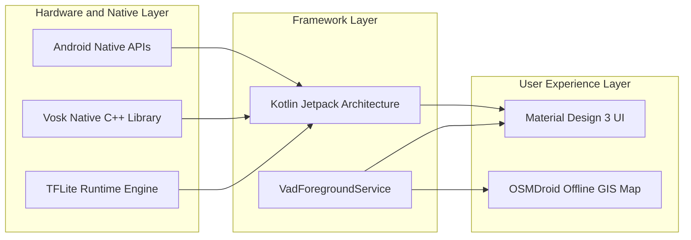
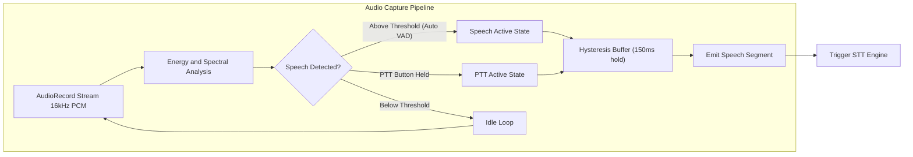
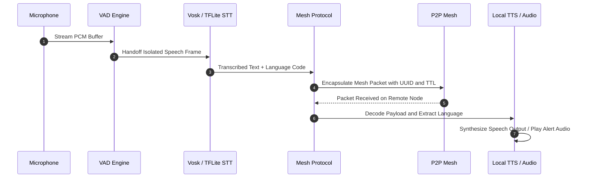
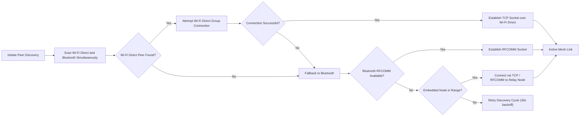
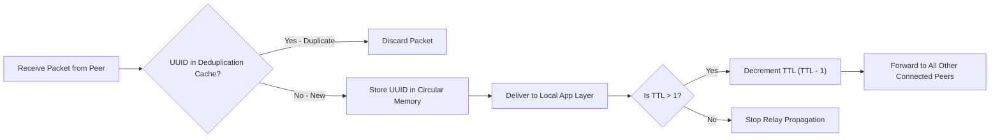
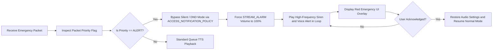
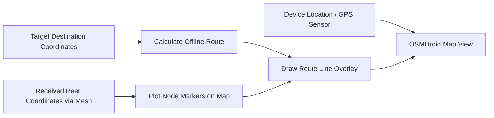

# Varta - Autonomous Multilingual Voice Mesh Relay

SIH Problem Statement: Build a fully offline, peer-to-peer Android communication system with on-device multilingual speech recognition and synthesis for 10 Indian languages, operable in zero-connectivity emergency and tactical scenarios.

---

## 1. Idea Title

**Varta: Autonomous Multilingual Voice Mesh Relay for Zero-Connectivity Emergency and Tactical Response**

Varta is a decentralized, serverless mobile communications platform designed for extreme disaster scenarios, tactical defense operations, and zero-connectivity environments where cellular towers, internet backbones, and power grids fail simultaneously. The name "Varta" means "conversation" or "message" in Hindi and Sanskrit, directly reflecting the system's purpose.

---

## 2. Technical Approach

Varta implements an end-to-end offline voice and message relay pipeline combining on-device AI inference, low-level digital signal processing, and peer-to-peer mesh networking across standard Android hardware. No cloud service, SIM card, internet connection, or external infrastructure is required at any stage of operation.

### Pipeline Summary

1. **Signal Acquisition and VAD State Machine**: Continuous 16kHz 16-bit PCM audio streams are captured via a persistent Android Foreground Service (`VadForegroundService`). An energy-thresholding state machine coupled with Silero-VAD TFLite neural inference automatically isolates speech from ambient noise using hysteresis buffering to prevent mid-word clipping.

2. **On-Device Multilingual Speech Processing (STT and TTS)**: Isolated speech segments are transcribed locally using Vosk C++ JNI bindings and quantized TFLite models supporting 10 Indian languages. Received text packets are synthesized back into spoken audio via a local TTS engine — no raw audio is ever transmitted over the mesh, conserving bandwidth.

3. **Hybrid P2P Mesh Transports**: Text packets are transmitted across physical peers using a dynamic dual-transport strategy: Wi-Fi Direct (IEEE 802.11 P2P) for high-bandwidth long-range transfer, and Bluetooth Classic (RFCOMM) as a low-power fallback. The system is also compatible with embedded hardware (e.g., Raspberry Pi, ESP32) implementing the same RFCOMM or TCP socket protocol.

4. **Decentralized Flood-Routing and Deduplication**: Managed by `MeshRouter`, messages are forwarded node-to-node across up to 5 hops (TTL limit). Loop prevention and broadcast storm suppression are enforced using a 128-bit UUID circular deduplication cache stored entirely in heap memory.

5. **System-Level Emergency Override**: High-priority alert frames bypass system Silent and Do-Not-Disturb (DND) modes using `ACCESS_NOTIFICATION_POLICY` and `STREAM_ALARM` audio routing to play maximum-volume sirens and voice announcements, ensuring no alert is silenced by the victim's device settings.

6. **Offline Spatial Navigation**: OSMDroid vector tile caching renders offline maps, peer node positions, and emergency navigation routes without any internet access.

---

## 3. System Architecture Overview

```mermaid
graph LR
    node_a["User Audio Input / Microphone"] --> node_b["VadForegroundService"]
    node_b --> node_c{"VAD Mode"}
    node_c -->|"Push-To-Talk"| node_d["Manual Hold Control"]
    node_c -->|"Auto VAD"| node_e["VadStateMachine and Silero Engine"]
    node_d --> node_f["Local STT Engine (Vosk / TFLite)"]
    node_e --> node_f
    node_f --> node_g["Message Serialization and Protocol Encoding"]
    node_g --> node_h["MeshRouter and TransmissionManager"]
    node_h --> node_i{"Transport Selection"}
    node_i -->|"High Bandwidth / Long Range"| node_j["Wi-Fi Direct Transport"]
    node_i -->|"Fallback / Low Power"| node_k["Bluetooth Classic Transport"]
    node_j --> node_l["P2P Mesh Network / Neighbor Nodes"]
    node_k --> node_l
    node_l --> node_m["Incoming Mesh Message"]
    node_m --> node_n["Deduplication Check (UUID Cache)"]
    node_n -->|"Duplicate / Expired TTL"| node_o["Drop Packet"]
    node_n -->|"New Message"| node_p{"Is Alert Mode?"}
    node_p -->|"Yes"| node_q["AlertAudioPlayer (DND and Silent Bypass)"]
    node_p -->|"No"| node_r["Local TTS Engine and Audio Playback"]
    node_p --> node_s["Relay to Connected Peers (TTL - 1)"]
```



---

## 4. Technology Stack and Architectural Rationale

| Technology / Component | Role in Varta | Why Selected |
|---|---|---|
| **Kotlin and Android Jetpack** | Primary application logic and UI | Provides native performance, direct memory management, and precise control over Android system services, hardware APIs (`AudioRecord`, `WifiP2pManager`), and background lifecycles. |
| **Vosk Speech Recognition (JNI / C++)** | Offline Speech-to-Text (STT) engine | Native C++ offline STT engine with extremely lightweight RAM footprint (~30-50 MB per language), zero cloud API reliance, fast real-time factor (RTF < 0.3), and strong Indic language support. |
| **TensorFlow Lite (TFLite Runtime)** | Neural VAD and acoustic model inference | Mobile runtime for Silero VAD and quantized INT8/FP16 acoustic models, optimized for ARM NEON CPU instructions on low-end hardware. INT8 quantization cuts model size by 4x versus FP32. |
| **Wi-Fi Direct (IEEE 802.11 P2P)** | Primary high-bandwidth mesh transport | Enables direct device-to-device TCP connections up to 250 Mbps across ranges of approximately 100 metres without routers, cellular towers, or internet infrastructure. |
| **Bluetooth Classic (RFCOMM)** | Low-power secondary transport | Acts as a low-power fallback link when Wi-Fi Direct connection negotiation fails, ensuring network continuity across mixed device environments and embedded hardware nodes. |
| **OSMDroid (OpenStreetMap)** | Offline vector mapping and GIS | 100% open-source offline mapping library capable of rendering pre-cached vector tiles, custom node overlays, and spatial route lines without Google Maps API keys or internet access. |
| **Android Foreground Services** | Persistent background engine | Enforces process survival against Android 14 background execution limits, keeping microphone listeners and P2P sockets alive even when the screen is off or the device is locked. |
| **`STREAM_ALARM` and Notification Policy API** | Emergency siren and DND bypass | Allows Emergency Alert broadcasts to bypass system Silent/Do-Not-Disturb modes and play audio at 100% volume for life-safety notifications. |
| **Python Model Conversion Pipeline** | Model quantization and asset export | Custom tooling (`tools/download_and_convert_models.py`) to convert open-source Indic AI models (AI4Bharat, HuggingFace MMS) into mobile-ready quantized TFLite assets. |



---

## 5. Comprehensive Feature Breakdown

### Feature 1: Walkie-Talkie Mode, Phone Mode, and Push-to-Talk

The SIH problem statement defines two distinct communication modes, both implemented in Varta:

- **Walkie-Talkie Mode (Half-Duplex)**: Voice messages are queued and played sequentially. Only one speaker transmits at a time. This mode conserves bandwidth on the mesh and is optimized for low-device-count tactical use. Push-to-Talk (PTT) button held to record, released to transmit.
- **Phone Mode (Full-Duplex)**: Continuous bidirectional audio capture and playback, simulating a live phone call over the mesh. Both peers can speak simultaneously; packets are timestamped and played in order at the receiver.

Both modes are served by `VadForegroundService` through the dual-path VAD pipeline:



---

### Feature 2: Offline Multilingual Speech Processing (STT and TTS)

Varta features a 100% offline speech recognition and text-to-speech engine supporting 10 major Indian languages as mandated by the SIH problem statement:

| Language | Code | STT Engine | TTS Engine |
|---|---|---|---|
| Hindi | `hi` | Vosk small model + TFLite | Android TTS + TFLite Vocoder |
| Gujarati | `gu` | TFLite IndicConformer | Android TTS |
| Marathi | `mr` | TFLite IndicConformer | Android TTS |
| Kannada | `kn` | TFLite IndicConformer | Android TTS |
| Malayalam | `ml` | TFLite IndicConformer | Android TTS |
| Tamil | `ta` | TFLite IndicConformer | Android TTS |
| Telugu | `te` | TFLite IndicConformer | Android TTS |
| Odia | `or` | TFLite IndicConformer | Android TTS |
| Bengali | `bn` | TFLite IndicConformer | Android TTS |
| English | `en` | Vosk small model | Android TTS |

Speech is converted locally into lightweight text frames before transmission, reducing mesh bandwidth consumption by over 90% compared to raw audio streaming. Upon packet reception, speech is synthesized locally at the receiver.



---

### Feature 3: Hybrid P2P Mesh Transport (Wi-Fi Direct + Bluetooth + Embedded Devices)

The transmission layer dynamically pairs Wi-Fi Direct and Bluetooth Classic to form resilient peer-to-peer links without relying on access points, cellular networks, or internet infrastructure.

- **Wi-Fi Direct**: Acts as the primary high-bandwidth link (~100m range, up to 250 Mbps throughput).
- **Bluetooth Classic**: Serves as a low-power fallback channel when Wi-Fi Direct fails (~10m range, ~2 Mbps throughput).
- **Embedded Device Compatibility**: Any hardware (Raspberry Pi, ESP32, custom relay nodes) implementing the same RFCOMM SPP UUID or TCP socket protocol can participate in the mesh as a relay node, extending range without adding phones.
- **Health Watchdog**: `TransmissionManager` monitors socket keepalives every 5 seconds and automatically migrates connections upon link degradation.



---

### Feature 4: Decentralized Mesh Routing and Packet Deduplication

Varta employs a flood-based mesh routing scheme managed by `MeshRouter`. Messages are forwarded node-to-node to extend communication coverage beyond direct radio range without any central server or coordinator.

To prevent broadcast loops and network congestion:
- **UUID Cache**: Every message has a unique 128-bit UUID. Received UUIDs are cached in a circular buffer in heap memory; duplicates are immediately discarded.
- **Time-to-Live (TTL)**: Each packet contains a TTL hop limit (default 5). The TTL decrements at each hop, terminating propagation when it reaches 0.



---

### Feature 5: Emergency ALERT Mode and DND Override

In critical scenarios, users can send high-priority Emergency Alerts that are guaranteed to be heard regardless of the recipient device's audio settings. Receiving nodes execute a full system override via `AlertAudioPlayer`:

- **Volume Override**: Forces system audio to maximum volume using `STREAM_ALARM` channel.
- **DND Bypass**: Uses `ACCESS_NOTIFICATION_POLICY` permissions to bypass system Do-Not-Disturb and Silent modes.
- **Visual Alert**: Triggers red visual indicators and continuous notification alerts on the UI.
- **Persistence**: Alert siren loops until the user manually acknowledges, ensuring it is not missed.



---

### Feature 6: Offline Dynamic Mapping and Navigation

Varta incorporates an offline mapping engine based on OSMDroid, providing tactical spatial awareness without internet connectivity:

- **Offline Vector Tiles**: Renders pre-cached map tiles and building structures stored locally on-device.
- **Node Tracking**: Overlays peer positions and emergency signals directly on the map in real time from received mesh packets.
- **Route Calculation**: Plots navigation routes between nodes with visual markers.
- **No API Keys Required**: OSMDroid uses OpenStreetMap data with no Google Maps dependency.



---

## 6. Feasibility and Viability

### Hardware and Resource Requirements

| Parameter | Value |
|---|---|
| **Minimum Android Version** | Android 8.0 (API 26) |
| **Target Android Version** | Android 14 (API 34) |
| **Release APK Size** | 175 MB (includes bundled Hindi Vosk + TFLite models) |
| **STT Model Asset Size** | ~90 MB (Hindi Vosk + TFLite; other languages downloaded on-demand) |
| **TTS Model Asset Size** | ~56 MB (Hindi acoustic + vocoder TFLite models) |
| **Active RAM Footprint** | ~80-120 MB per active language model loaded |
| **Minimum RAM Recommended** | 2 GB device RAM |
| **CPU Requirement** | ARM Cortex-A53 or better (any modern Android phone) |
| **Mesh Range (Wi-Fi Direct)** | Up to 100 metres line-of-sight |
| **Mesh Range (Bluetooth)** | Up to 10 metres |
| **Network Infrastructure Required** | None (0% dependency) |

### Competitive Comparison

| Capability | Varta (This Solution) | WhatsApp / Signal | Zello Walkie-Talkie | GoTenna Mesh |
|---|---|---|---|---|
| Works with zero internet | Yes | No | No | Yes (limited) |
| Works with zero cellular | Yes | No | No | Yes |
| Multilingual (10 Indic languages) | Yes | No | No | No |
| DND / Silent override for emergencies | Yes | No | No | No |
| Offline map with peer tracking | Yes | No | No | No |
| 100% open-source, zero license cost | Yes | No | No | No |
| Embedded hardware relay nodes | Yes (RFCOMM / TCP) | No | No | Proprietary hardware only |
| Deployable via APK share (no Play Store) | Yes | No | No | No |

### Economic and Operational Viability

Built entirely on an open-source software stack (Kotlin, Vosk, TFLite, OSMDroid), Varta carries zero licensing costs. It can be deployed instantly during emergencies by distributing an APK file via local Wi-Fi Direct or Bluetooth share, requiring no app store connectivity, no account creation, and no registration.

### Power and Battery Efficiency

By converting speech to lightweight text frames before transmission, Varta reduces radio transmitter uptime by over 90% compared to raw audio streaming. The VAD state machine idles the audio pipeline during silence periods, significantly reducing CPU and battery consumption during passive monitoring.

---

## 7. Impact and Benefits

- **Life Safety in Disasters**: Provides immediate, resilient communication channels for trapped survivors, emergency workers, and disaster response teams during floods, earthquakes, cyclones, and total blackout events where all conventional infrastructure fails.

- **Multilingual Emergency Inclusivity**: Removes language barriers in high-stress disaster situations by supporting 10 major Indian regional languages with local transcription and voice synthesis, catering to users who are not literate in any written script.

- **Audible Emergency Reach**: The DND and Silent Mode override ensures critical distress broadcasts and evacuation alerts are audibly received even when the victim's device is set to silent or Do-Not-Disturb, a common scenario when people are sleeping or in meetings before a sudden disaster.

- **Tactical Search and Rescue**: Integrates offline vector mapping with peer node position overlays, allowing search-and-rescue teams to navigate terrains, coordinate grid searches, and locate missing individuals without internet connections or operational command centers.

- **Zero Infrastructure Deployment**: Can be distributed and operational within minutes of a disaster event without requiring any pre-positioned hardware, server infrastructure, satellite uplinks, or licensed radio equipment.

- **Scalable Mesh Coverage**: Each additional device with Varta installed automatically extends the mesh network coverage area, meaning that relief teams, volunteers, and survivors all organically expand the communication network as more people arrive in a disaster zone.

---

## 8. Project Directory Structure

```
OfflineVoiceRelay/
├── app/
│   ├── build.gradle                  # Groovy Android build configuration
│   └── src/
│       ├── main/
│       │   ├── AndroidManifest.xml   # Permissions, Foreground Service and Activity manifests
│       │   ├── java/com/offlinevoicerelay/
│       │   │   ├── model/            # Language enums and Message Protocol Definitions
│       │   │   ├── vad/              # VadEngine, VadStateMachine, VadForegroundService
│       │   │   ├── stt/              # Vosk and TFLite Speech-to-Text implementations
│       │   │   ├── tts/              # Text-to-Speech and AlertAudioPlayer overrides
│       │   │   ├── mesh/             # WifiDirectTransport, BluetoothTransport, MeshRouter
│       │   │   └── ui/               # MainActivity, MapActivity, ChatActivity, DeviceListActivity
│       │   └── res/                  # Layouts, Drawables, Values, and Vector Graphics
└── tools/                            # Offline model conversion and evaluation tools
    └── download_and_convert_models.py
```

---

## 9. Technical Specifications and Standards

| Specification | Details |
|---|---|
| **Target SDK** | Android 14 (API 34) |
| **Minimum SDK** | Android 8.0 (API 26) |
| **Supported Languages** | Hindi, Gujarati, Marathi, Kannada, Malayalam, Tamil, Telugu, Odia, Bengali, English |
| **Audio Format** | 16kHz Mono 16-bit PCM |
| **P2P Transports** | Wi-Fi Direct (IEEE 802.11a/b/g/n/ac) and Bluetooth Classic (RFCOMM) |
| **Mesh Protocol** | Flood-routing with 128-bit UUID deduplication and 5-hop TTL limit |
| **Communication Modes** | Walkie-Talkie (Half-Duplex PTT) and Phone (Full-Duplex) |
| **Network Dependency** | 0% — Operates fully offline without cloud, SIM, router, or satellite infrastructure |
| **Release APK Size** | 175 MB |
| **Open-Source License** | Apache 2.0 (Vosk, TFLite, OSMDroid) |

---

## 10. Research and References

1. **Mobile Ad-Hoc and Peer-to-Peer Mesh Networks**:
   - Camps-Mur, D., Garcia-Saavedra, A., and Serrano, P. (2013). *Device-to-device communications with Wi-Fi Direct: overview and experimentation*. IEEE Wireless Communications, 20(3), 96-104.
   - IEEE 802.11-2016 Standard: *Wireless LAN Medium Access Control (MAC) and Physical Layer (PHY) Specifications*. IEEE Computer Society.
   - Bluetooth Special Interest Group. (2019). *Bluetooth Core Specification v5.1 — RFCOMM Serial Port Profile (SPP)*. Bluetooth SIG.

2. **Offline Speech Recognition and Neural Inference**:
   - AlphaCephei. (2023). *Vosk Offline Speech Recognition API*. https://alphacephei.com/vosk/
   - Silero Team. (2021). *Silero VAD: pre-trained enterprise-grade Voice Activity Detector*. GitHub: https://github.com/snakers4/silero-vad
   - TensorFlow Lite Team. (2023). *TensorFlow Lite for Mobile and Embedded Devices*. Google AI Documentation. https://www.tensorflow.org/lite

3. **Indic Multilingual NLP and Speech Checkpoints**:
   - AI4Bharat. (2023). *IndicConformer: Unified Speech Recognition for 22 Indian Languages*. IIT Madras. https://ai4bharat.iitm.ac.in/
   - Pratap, V., et al. (2023). *Scaling Speech Technology to 1,000+ Languages (Massively Multilingual Speech — MMS)*. Meta AI Research. arXiv:2305.13516.
   - Babu, A., et al. (2022). *XLS-R: Self-supervised Cross-lingual Speech Representation Learning at Scale*. Interspeech 2022.

4. **Voice Activity Detection and Audio Processing**:
   - Tan, Z., and Wang, D. (2020). *Learning Complex Spectral Mapping With Gated Convolutional Recurrent Networks for Monaural Speech Enhancement*. IEEE/ACM TASLP.
   - Ding, S., et al. (2021). *Personal VAD 2.0: Optimizing Personal Voice Activity Detection for On-Device Speech Recognition*. Interspeech 2021, arXiv:2109.05539.

5. **Offline Cartography and Spatial Systems**:
   - OpenStreetMap Contributors. (2024). *OpenStreetMap Data and OSMDroid Mapping Library for Android*. https://github.com/osmdroid/osmdroid
   - OpenStreetMap Foundation. (2024). *OpenStreetMap Open Database License (ODbL)*. https://www.openstreetmap.org/copyright

6. **Disaster Communication and Emergency Systems**:
   - Reina, D. G., et al. (2018). *A Survey on the Application of Wireless Sensor Networks to Forest Fire Detection*. MDPI Sensors.
   - ITU-T. (2021). *Recommendations for ICT in Disaster Relief and Emergency Communications*. International Telecommunication Union.
